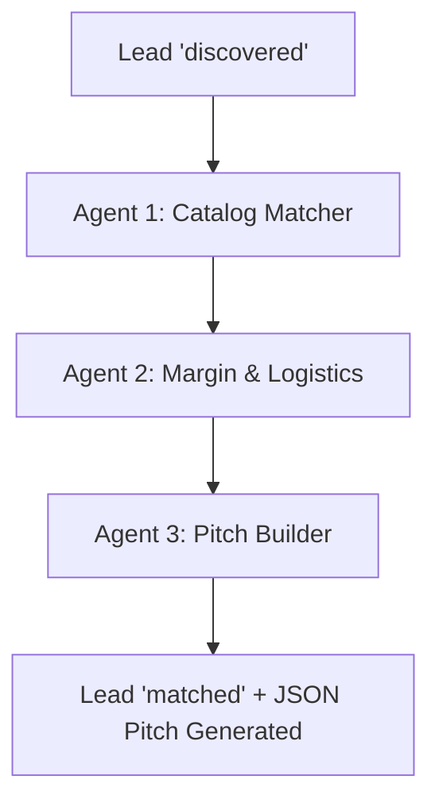

# SOP: Multi-Agent Lead Qualification & Catalog Matching

## Architecture Overview
A sequential 3-agent orchestration pipeline processes every lead with status `'discovered'` to qualify their buyer profile, match authentic Moroccan artisan lines, compute logistics/margins, and formulate a targeted value proposition.

---

## Agent Specifications

### Agent 1: Catalog Matcher
- **Goal**: Analyze the store's visual identity, product taxonomy, and aesthetic tags to map to 1-3 core Moroccan craft lines:
  - `zellige_pottery`: Tamegroute emerald pottery, Safi handcrafted ceramics, glazed terracotta zellige tiles.
  - `tuareg_leather`: Hand-tanned goat/camel leather poufs, minimalist tote bags, travel accessories.
  - `berber_rugs`: Authentic Beni Ourain high-pile wool rugs, vintage Azilal, Kilim runners.
  - `brass_lighting`: Hand-pierced / hammered solid brass pendant lamps, sconces, and lanterns.
  - `woodcraft`: Sculpted Atlas cedar bowls, Essaouira burl thuya boxes, and bespoke furniture.
- **Output**: `primary_craft`, `matched_lines`, `aesthetic_alignment_score` (0.00 - 1.00), and `style_notes`.

### Agent 2: Margin & Logistics Calculator
- **Goal**: Calculate pricing tiers, MOQs, packaging specifications, and shipping estimates from Marrakech to the store's destination country.
- **Calculations**:
  - **Sample Tier (0 MOQ)**: 1 to 5 pieces. Express Air (DHL/FedEx, 3-5 days).
  - **Boutique Stock Tier (6-50 pcs)**: 15% discount. Mixed craft assortment. Air / Express Road Freight.
  - **Wholesale Container Tier (50+ pcs)**: 35% discount. Ocean freight via Casablanca / Tanger Med or direct palletized transport.
  - **Transit Cost & Time**: Calibrated per destination country (France ~3-4 days, Spain ~2-3 days, Italy ~3-5 days, Germany ~3-5 days, Netherlands ~3-5 days).
- **Output**: `sample_wholesale_price`, `suggested_moq`, `est_shipping_usd`, `est_transit_days`, `recommended_incoterm` (`EXW`, `FOB`, `DAP`).

### Agent 3: Personalized Pitch Builder
- **Goal**: Synthesize inputs from Agent 1 and Agent 2 to construct a high-converting, tailored B2B outreach proposition.
- **Value Propositions Highlighted**:
  1. Direct master-artisan sourcing in Marrakech (no distributor/middleman markup).
  2. Flexible low-risk 0 MOQ sample order to test market reception in their store.
  3. Custom branding & bespoke dimensional adaptations for their specific clientele.
  4. Complete export certification (EUR.1 / Certificate of Origin, 0% customs friction).
- **Output**: Structured JSON object with `subject_line`, `personalized_hook`, `product_recommendations`, `margin_highlights`, `cta_copy`, and `lookbook_theme`.

---

## Execution Tool
- Script: `execution/multi_agent_engine.py`
- Output: Leads updated with status `'matched'` and `qualification_data` JSON.
